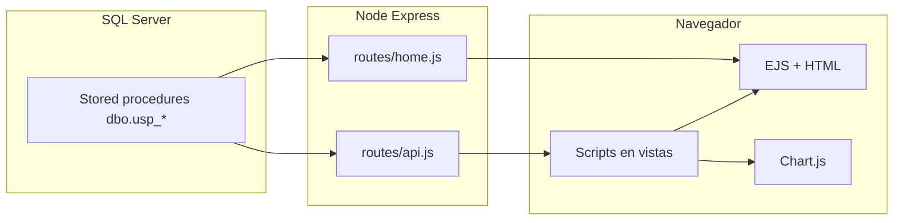

# Flujo de datos (de la base a la pantalla)

## Diagrama lógico

## Paso a paso por tipo de contenido

### A. KPIs “Día anterior” en General

1. El usuario abre **`GET /`**.
2. **`routes/home.js`** obtiene pool y ejecuta `EXEC dbo.usp_Dashboard_General_DiaAnterior @AsOfDate = NULL`.
3. El primer registro del `recordset` se mapea a `kpis` (números, porcentajes, líneas “Campo”).
4. **`res.render("home", { kpis, ... })`** inyecta `kpis` en **`home.ejs`**; el HTML llega al navegador ya renderizado en esa sección.

### B. Tablas y gráfico de mensajería en General

1. El HTML de **`home.ejs`** incluye tablas vacías/cargando y un `<canvas>`.
2. El script en la misma página llama **`fetch(`${BASE_PATH}/api/ultimos7?...`)`** (diario) o **`/api/envio-mensual?...`** (mensual).
3. **`routes/api.js`** ejecuta el SP correspondiente con `@AsOfDate`, `@Motivo`, `@DaysBack` según query string.
4. La respuesta JSON incluye arreglos **`data`** y **`avg`**.
5. El script **ordena** filas por fecha, **genera filas** `<tr>` para el `<tbody>`, opcionalmente aplica clases de heatmap, y llama **`buildChart(rows)`** para **Chart.js** (datasets de enviados, ok, mal, %Respuestas, %OK).
6. El botón **Excel** lee los mismos arreglos en memoria (`lastRows` / `lastRowsMensual`) y genera un `.xlsx` en el cliente con **SheetJS**.

### C. Detalle intradiario (`/metricas`)

1. **`GET /metricas`** solo devuelve HTML de **`metricas.ejs`** sin filas de datos.
2. Al cargar, el script hace **`fetch(/api/detalle?motivo=&dias=10&page=&pageSize=)`**.
3. El servidor ejecuta **`usp_Dashboard_DetalleIntradiario`** y devuelve `data` + `total` + paginación.
4. El cliente **reemplaza el tbody** con strings HTML derivados de cada fila.

### D. Cierres (`/cierres`)

1. HTML inicial desde **`cierres.ejs`**.
2. **`fetch(/api/cierres?dias=N)`** → **`usp_Dashboard_CierresPorDia`**.
3. El cliente calcula estilos de heatmap, pinta la tabla y construye un **Chart.js** apilado + línea de promedio usando `avg` de la respuesta.

### E. Búsqueda (`/busqueda`)

1. El usuario ingresa término y hace clic o Enter.
2. **`fetch(/api/busqueda?term=...)`** → **`usp_Busqueda_Seguimiento`** (salvo `term` vacío, que corta en servidor).
3. El cliente **renderiza** divs con texto a partir de cada elemento de `data`.

### F. Salud de base (`/health/db`)

1. Petición directa al JSON; no participa el flujo EJS de las pantallas principales.

## Puntos de fricción típicos en el flujo

- Desfases de **zona horaria**: el servidor normaliza fechas de API `ultimos7` en UTC para SQL; el cliente usa fechas **locales** para el rango por defecto en home (`setDefaultDateRange`).
- **`BASE_PATH`**: si no coincide entre servidor y enlaces, los `fetch` pueden ir a la ruta equivocada en producción.
- **Contrato de columnas**: el renderizado asume nombres de propiedades que devuelven los SP; un cambio en BD rompe el JS sin fallar en compilación.
